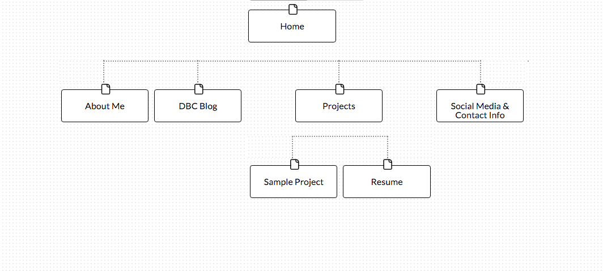

#### Week 2 Design Reflections

## My prospective site map

### Reflections

## What are the 6 Phases of Web Design?
1. Information gathering - When designing a website, you should first gather all of the necessary information that you will need. You need to identify the purpose of this website, what goals you want to accomplish, and who the target audience is. From their, it will be easy to find or create content that can be used.
2. Planning (create a site map) - In this phase, you will be able to look over the information you have gathered and organize them into certain groups. Each group could potentially represent a certain feature or page for your eventual website. Here you can arrange those pages into a *site map* for an effective, organized representation of how your website will be structured.
3. Design - Here, you will work on developing the overall feel of your website. It is important to develop your website to the taste of the target audience, and you will want to develop an effective user interface. Common human-computer interface subjects and processes will be used such as developing wireframes, paper prototypes, or mock-ups for some initial testing before you actually develop the website.
4. Development - Once your website's design is completed, it is time to start coding! Here we can write code in HTML/CSS or use content management systems to create pages to display the things we want.
5. Testing and Delivery - It is important to make sure that your website is thoroughly tested before it is released to the public. Make sure all of the features included work as desired and that nothing is broken. It can be useful to have some testers come in and try playing around with the website to get feedback. Watching a tester try to accomplish a task could reveal things that were previously unseen.  Once the website is properly vetted, it is time to publish it and release it to the world using a file transfer protocol program. You can also look into ways to make your website more public for search engines now.
6. Maintenance - You are not finished though. It is important to constantly go back and review what you have. Successful websites will continuously improve on themselves with new updates.

## What is your site's primary goal or purpose? What kind of content will your site feature?
The goal of my website will be to advertise myself. I will want people to be able to checkout my website and learn about who I am, what I've done, and what I plan to do. I will include some background information about myself, a link to my blog, my current and past projects (portfolio), my resume, social media accounts (LinkedIn) and some sort of contact information.

## What is your target audience's interests and how do you see your site addressing them?
My target audience is anyone who wants to learn more about me. That being said, this website will a great way for potential employers to learn more about my self. I will have applicable information about my self that employers will want to see such as my portfolio and resume.

## What is the primary "action" the user should take when coming to your site? Do you want them to search for information, contact you, or see your portfolio? It's ok to have several actions at once, or different actions for different kinds of visitors.
I want people to see my portfolio first. That will be the main selling point that I want potential employers to see. If I have an attractive portfolio in an effective website, then hopefully I can attract those employers to contact me.

## What are the main things someone should know about design and user experience?
In development, it is important to pay attention to design and user experience. User experience design is about creating a usable and accessible interface that an audience will interact with. But there is no one solution that can fit every website or piece of software; the developer should tailor the design to what the audience and goals are. Traditional metrics such as page views do not coincide with a good user experience. User experience design is also not exactly the same as usability.

## What is user experience design and why is it valuable?
User experience design is about creating a usable and accessible interface that an audience will interact with. Good practices design and user experience include elegant design decisions that allow the user to easily browse the website/software. It is important to tailor the design to the prospective audience (don't include flashy fonts for a bank website). Users don't want to feel like the website is too complicated for them to navigate through. Good user design is all about a good interaction with the product. When a developer chooses to develop with user experience design in mind, their customers will become more satisfied with their experience with the software.

## Which parts of the challenge did you find tedious?
The hardest part for this challenge was figuring out what the relative path for the inline image should be. It took a couple tries to get the correct path to display the image. In GPS 1.1 I actually used the the absolute path, which I now realize was the wrong thing to do.