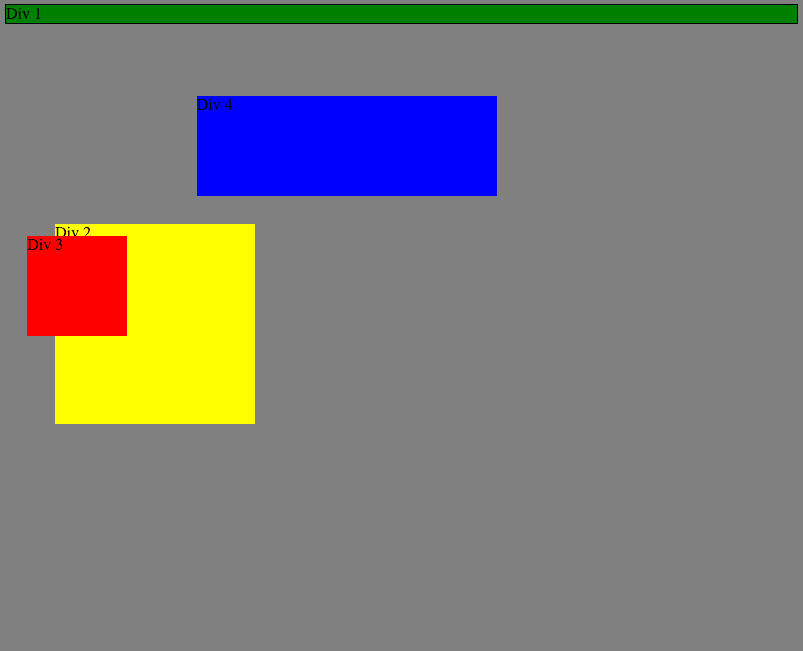
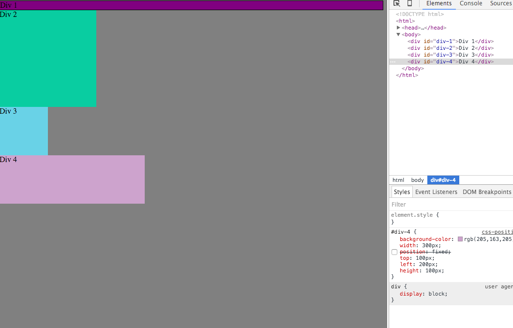
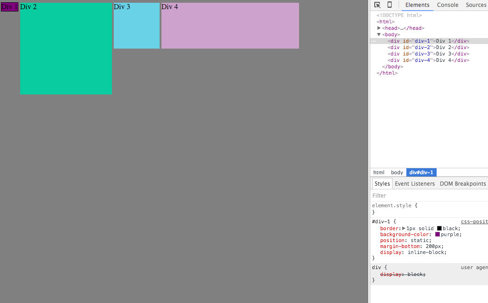
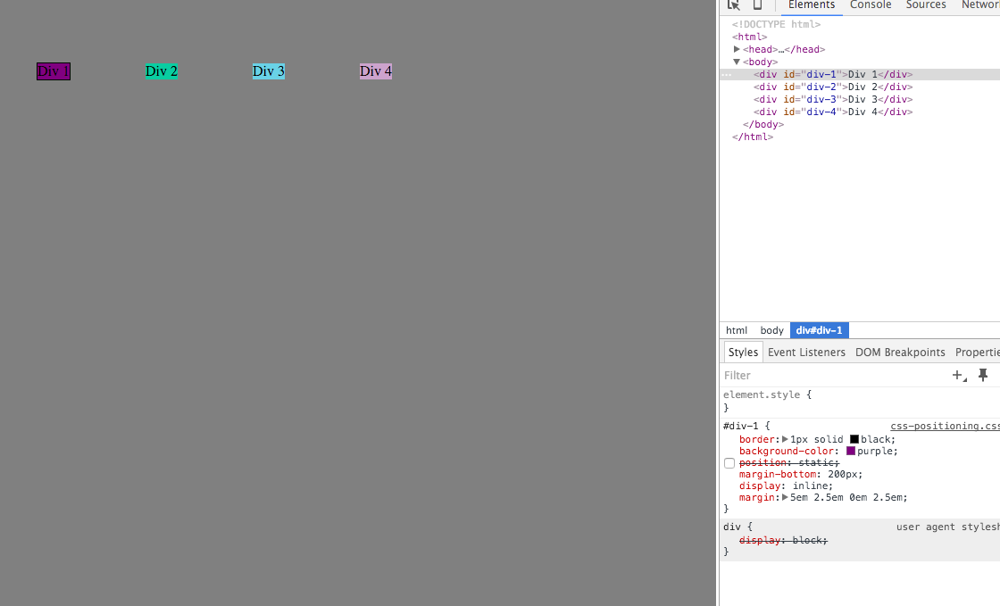
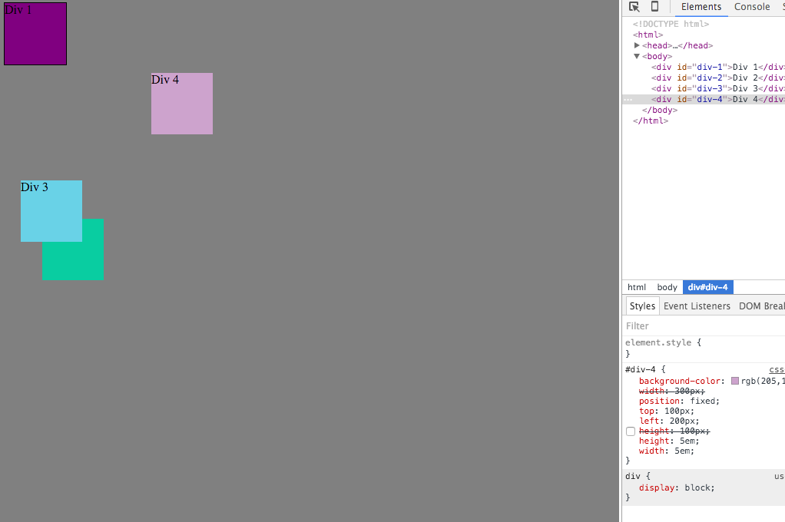
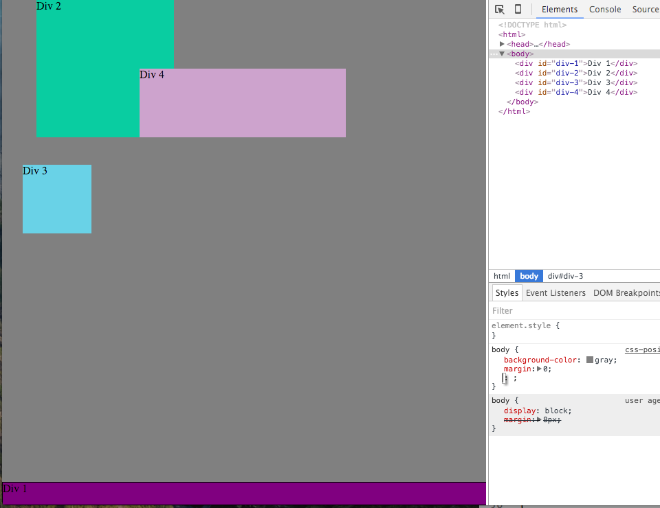
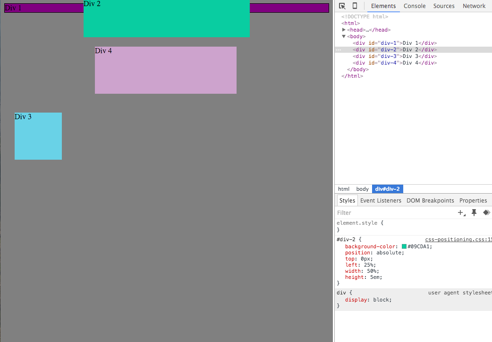
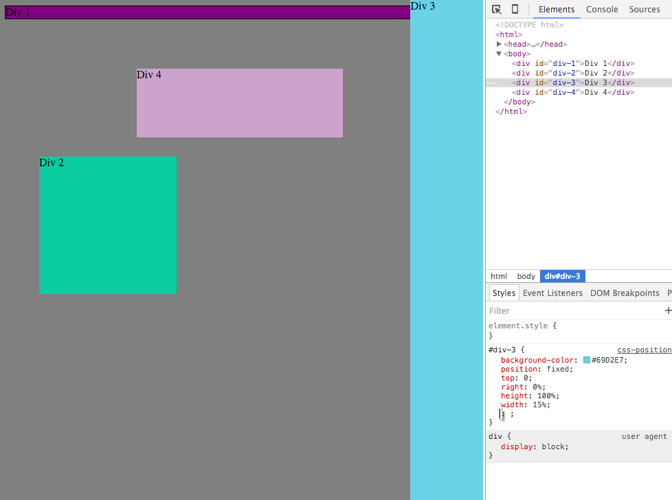
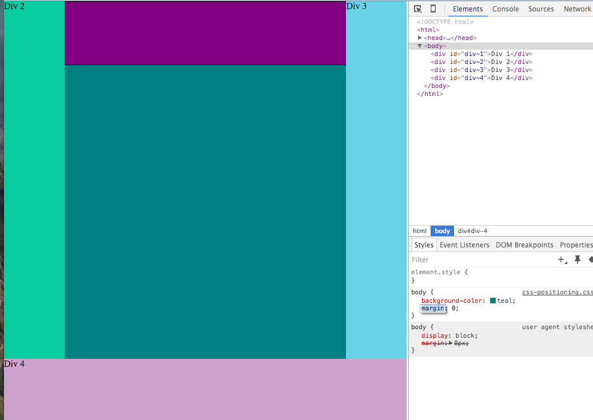

# Week 3
## Peer-programing 3.4 Reflections and Screenshots

### Reflections

#### How can you use Chrome's DevTools inspector to help you format or position elements?
DevTools allows you to interact with a webpage's elements in real time. You can do cool things like edit HTML or CSS to modify the elements for testing purposes. In the challenge we completed, we had the ability to change the CSS positioning and formatting presets, and we were able to see the changes in real-time without modifying the original code.

#### How can you resize elements on the DOM using CSS?
There are many different ways to resize elements. You could edit the `height` and `width` to be a certain pixel size or a relative size (em). You could also set the height or width to a certain percentage relative to the size of the screen.

#### What are the differences between absolute, fixed, static, and relative positioning? Which did you find easiest to use? Which was most difficult?
* Absolute positioning allows an object to be in a spot relative to the nearest prior object that was created in HTML.
* Fixed positioning has objects in a certain spot and keeping them in a fixed state. They will not move when the page is scrolled.
* Static positioning is the default state. There are no special additions to static positioning.
* Relative positioning puts an object in a spot relative to its static position.

For me fixed positioning is the easiest to remember because it was easy to put an object in one spot and keep it there. Absolute is probably the hardest to remember since I would have to find out what the nearest ancestor is in the HTML code.

In my opinion I don't see a huge demand for static positioning and would recommend any of the others over it. Even though absolute positioning was a little hard to understand, I think that type and fixed are going to be the most useful for us to use for our websites.

#### What are the differences between margin, border, and padding?
* Padding is the immediate area surrounding content like objects. This is transparent.
* The border is the area outside the padding and acts as the edge of the element. This can be displayed as a boundary.
* Margin refers to the outmost space around the object, padding, and border and creates an area outside the border. This is transparent.

So basically Margin > Border > Padding > Content

#### What was your impression of this challenge overall? (love, hate, and why?)
I liked this challenge a lot. After some initial confusion on what to do it was really nice to see real-time changes to the CSS. I can see how this will be really helpful for when I'm designing and formatting my personal website.

### Screenshots
1. Change the Colors 
2. Column 
3. Row 
4. Make Equidistant 
5. Squares 
6. Footer 
7. Header 
8. Sidebar 
9. Get Creative 