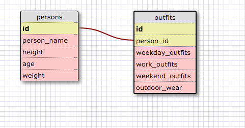

## My Solution 8.4

##### Release 5:
1. Select all data for all states:
	
	`SELECT * FROM states;`
2. Select all data for all regions:

	`SELECT * FROM regions;`
3. Select the state_name and population for all states:

	`SELECT state_name, population FROM states;`
4. Select the state_name and population for all states ordered by population. The state with the highest population should be at the top:

	`SELECT state_name, population FROM states ORDER BY population DESC;`
5. Select the state_name for the states in region 7:

	`SELECT state_name FROM states WHERE region_id=7;`
6. Select the state_name and population_density for states with a population density over 50 ordered from least to most dense:

	`SELECT state_name, population_density FROM states WHERE population_density>50 ORDER BY population_density;`
7. Select the state_name for states with a population between 1 million and 1.5 million people:

	`SELECT state_name FROM states WHERE population BETWEEN 1000000 AND 1500000;`
8. Select the state_name and region_id for states ordered by region in ascending order:

	`SELECT state_name, region_id FROM states ORDER BY region_id;`
9. Select the region_name for the regions with "Central" in the name:

	`SELECT region_name FROM regions WHERE region_name LIKE '%Central%';`
10. Select the region_name and the state_name for all states and regions in ascending order by region_id. Refer to the region by name. (This will involve joining the tables):

	`SELECT region_name, state_name FROM regions LEFT JOIN states ON regions.id=states.region_id;`
	
##### Release 6: 

##### Reflections:
1. What are databases for?
	
	Databases are collections of data that are stored and organized. This collection of data is easily accessible and can be easily updated.

* What is a one-to-many relationship?

	A one-to-many relationship is when one category in one table can relate to many other records in another table. This one parent can have many children, but the children all only have one parent.  

* What is a primary key? What is a foreign key? How can you determine which is which?

	A primary key is a key that is unique for each row of data in a database. A foreign key exists in one table but will relate to a rows of a different table. To figure out which is which, we can look to see how primary keys never repeat in their table, while foreign keys from a different table can point to these primary keys.

* How can you select information out of a SQL database? What are some general guidelines for that?

	There are many different commands that can be used such as SELECT, FROM, LIKE, BETWEEN, WHERE, ORDER BY, etc. The general guidelines for selecting information is to include commands in all caps, but then order the commands as SELECT columns, FROM database WHERE condition. We can also JOIN categories if needed (with primary and foreign keys). 