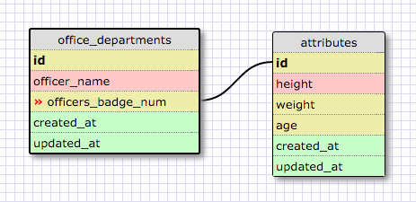
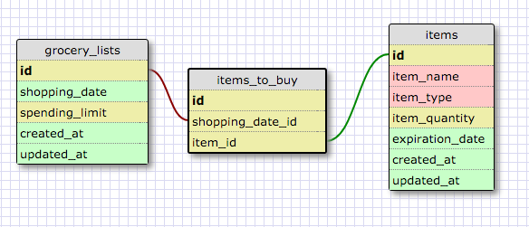

## 8.5 More schemas

##### Release 2:

This demonstrates a one-by-one relationship because each officer has one specific badge number which can relate to id in attributes (I guess it would be the same number as id in office_departments too...). That id will have information specific, yet not required, for each officer, such as age and height.  

##### Release 4:

I probably should have included a "cost" field in items...

##### Reflections:

1. What is a one-to-one database?

	A one-to-one database is a database where one field in one table relates uniquely to one field in another table to the point where both tables could seamlessly be joined. The reason why they aren't joined though is because the secondary table is considered extra, optional data.
	
2. When would you use a one-to-one database? (Think generally, not in terms of the example you created).

	When you have supplementary information that could at some point be useful. But otherwise this information is rarely used and not essential. 

3. What is a many-to-many database?

	A many-to-many database is when there are two or more distinct tables in a database. However, these distinct tables can be linked or joined using their id's. This allows many different id's in one table to match with many different id's in another table.

4. When would you use a many-to-many database? (Think generally, not in terms of the example you created).

	When you have nested sets of data. Like say you have multiple properties in one table. They can each host their own sets of information, which can itself be organized into a table. 

5. What is confusing about database schemas? What makes sense?

	The overall ideas make sense, but it was really hard to make my own tables in Release 2 and 4 because I couldn't picture how to make tables for a random one-to-one relationship or a grocery list. 